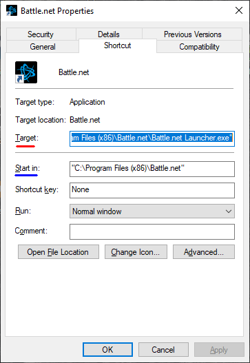
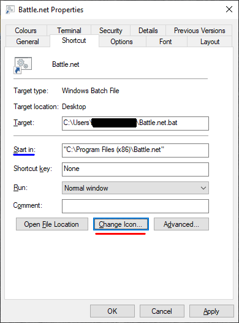
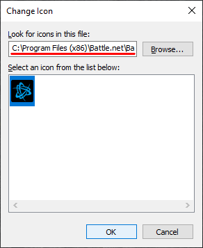

# Overwatch: Mystery languages

It's like mystery heroes, but worse!

A simple Python script to randomise the language you play Overwatch in.
The script takes the installed languages on your PC, and chooses one that you don't currently have equipped.
The text and voice lanuage are set to be the same, because it would be wonky otherwise.

## Notes:
- After launching the Battle.net app using the script, make sure the app fully loads before clicking `Play` or `Settings`.
- You must have more than one language installed in the Battle.net app for Overwatch. 
Simply install them like normal by choosing them from Overwatch settings inside the Battle.net app.
- You may or may not need to be an admin to do this, testing is required

## Installation:
###### Base:
1. Make sure you have Python 3 installed
1. Make sure you are running Windows (10)
1. Download the `Battle.net.bat` and `shuffler.py` files from the
[releases page](../../releases) and place them in a safe place on your computer
1. Right-click on `Battle.net.bat` and press `Create shortcut`
1. Drag the shortcut to your desktop
###### If you want to get the same logo as the real app:
1. Right-click your *real* Battle.net shortcut, click on `Properties`
and note down the values shown in blue and red in the first picture.
1. Delete your *real* Battle.net shortcut and rename the *fake* 
shortcut to `Battle.net`
1. Right-click your *fake* Battle.net shortcut and click on `Properties`
1. Paste the value noted down earlier in blue into the `Start in:` field
as seen in the second picture
1. Click `Change Icon...`
1. Accept the fact that there are no images in the .bat file
1. Paste the value noted down earlier in red into the 
`Look for icons in this file:` field
1. Select the Battle.net icon and press OK
1. Close the Properties tab and refresh the desktop by pressing F5

  

## User reviews:
- 10/10 completely useless POC (Krusher99)
- Very epic (Granny)
- Now I can finally drop down to bronze in peace (Granny 2)
